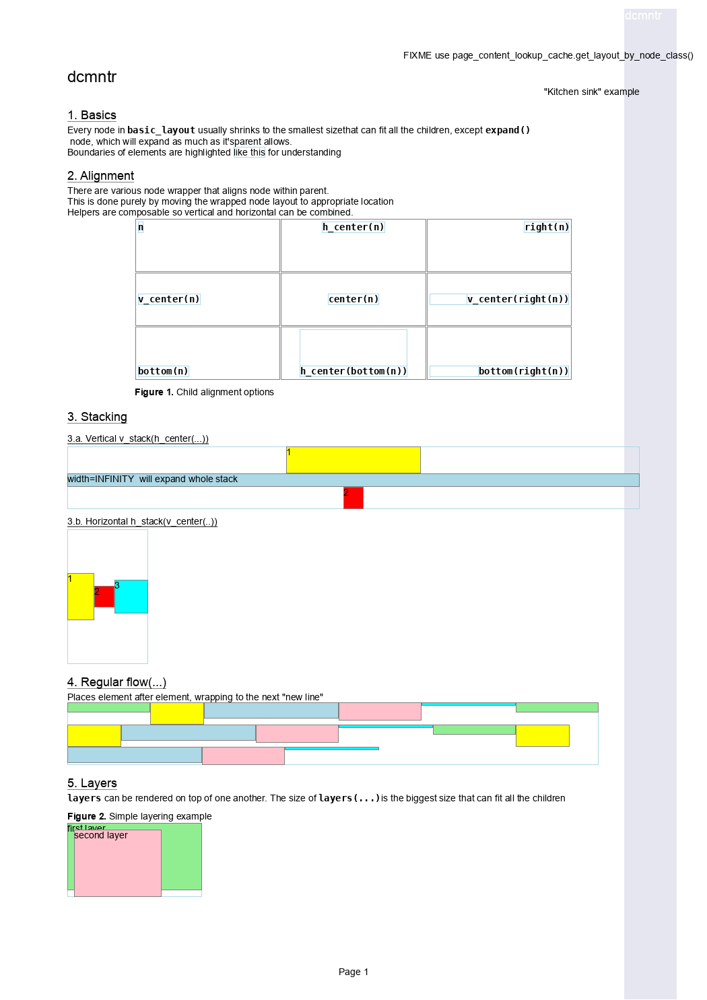
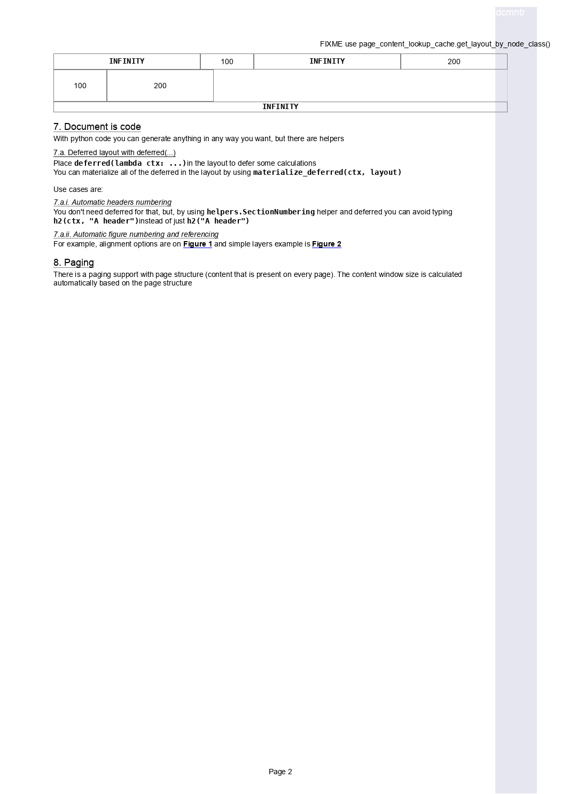
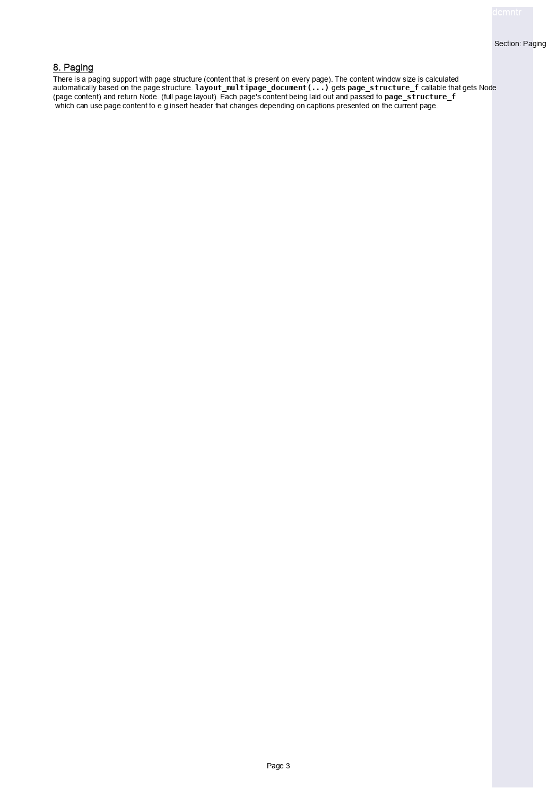

from documenter.basic_layout import simple_textfrom kitchen_sink.style import mono_font

# dcmntr

Pure(ish) Python Document generation library. Inspired by [Typst](https://typst.app).
But, instead of adding function to layout language, adds layout functions to Python.


The "tags" are just functions that returns `Node`s that can be rendered later. For example:
```python
def code(text: str) -> Node:
    return simple_text(text, mono_font, color=text_color)
```

In addition to that, instead of having "rich" tags that can do padding, alignment, sizing e.t.c...
each "tag" controls single aspect of layout or/and rendering:

```python
def stack_item(color: str) -> Node:
    return padding(top=10, left=2, right=2, bottom=1)(
      outline(border_color=color, border_width=2)(
        box(120, 30)(
          center(
            simple_text("item", text_font, color="black")
          )
        )
      )
    )
```

For more examples, see [tests folder](./tests)

## FAQ

### Q: But why, layout engines are not easy to implement!
A: I didn't know that. Also, for static layout there is no need for a fancy optimizations.

### Q: But why, I can just make some html and run some headless browser.
A: Yes, you can. However:
* It needs a several dependencies, including parts of X window.
* It silently hides elements that do not fit.
* Bulky reset css.
* Good luck doing weird stuff with it (like multipage document with )

### Q: Byt why?
A: Just because you can do things.

## What is supported

Of course, anything you can do in code (functions, generation, even/odd).
But also:

* Alignment (incl. vertical), alignment can be nested and will work as expected
* Very simple text rendering
* Stacking of items
* Dividing available space horizontally or vertically
* Padding
* Drawing outilnes of elements
* Images (whatever Pillow supports)
* Flow (puts elements left to right, wrap on overflow)
* Paging:
  * Every-page layout (can be used to implement header/footer/backgorund) with access to page content 
  * One can embed document page(s) into another document.
  * Most elements support split by page boundary
  * Support for no page breaking (nobr-like)
* Extra
  * Figure numbering and reference
  * Headers numbering
  * Deferred layout





## Not implemented yet

### Documentation
* Formalize layout rules for `basic_layout` nodes
* Guide on Node implementation

### Optimizations
* Profile speed (kitchen sink example)
* Profile memory size (kitchen sink example)

### Code
* Make sure the node has exactly required number of child nodes
  * Currently, it is an `assert` in Nodes' code
* Add more convenient children `some_node(some_iterator, a_node, a_list)`:
  * Each argument to __call__ can be a generator or list or node, so flatten
* Check for negative Size and Constraints.

### Layout
* Add option for box to fit to content in some dimension
  * it is either fixed or infinitely expanding at the moment
* Add higher level layout module with predefined elements for specific usecases
* More nodes:
  * Tables (can work for layout too, no snobbery here!)
  * Lists?
  * Columnar layout with automatic wrap to the next column
  * Math formulas
  * Images enhancements
    * Let customer decide if any extra library would be a dependency
    * Figure out better scaling (original size, scale up, thumbnail)
* Add support for richer text formatting
  * `flow(simple_text(), simple_text(),...)` nodes does not follow baseline, think about something else
  * Add word wrap support
  * Add text alignment options inside `simple_text` node
  * Markdown support
    * Would be ironic

### Rendering
* Better text rendering and precise size calculation
* Support scale factor in render?
  * Internals of nodes probably must be reworked in this case
  * Fonts support probably, must be re-worked in this case
* Add PDF support
  * Add extra features that are not supported by images (e.g. links)

### Examples
* Report with tables and images
* Entrance ticket
* Some crazy "annotations on top of the page" examples
